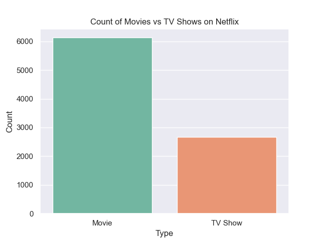
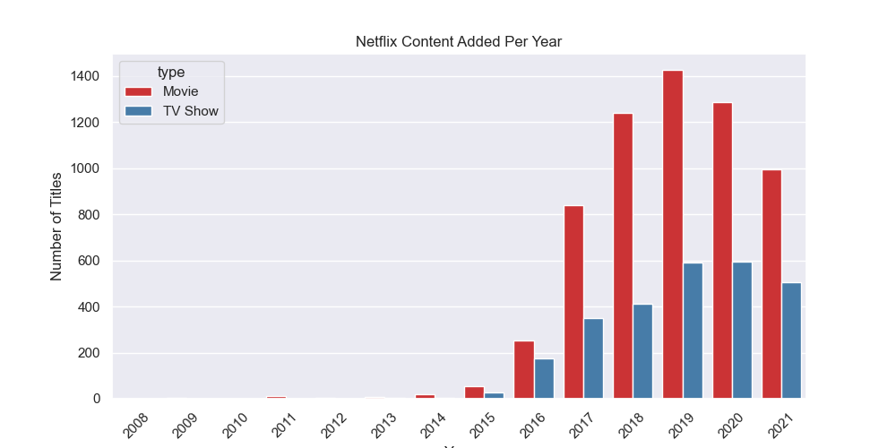
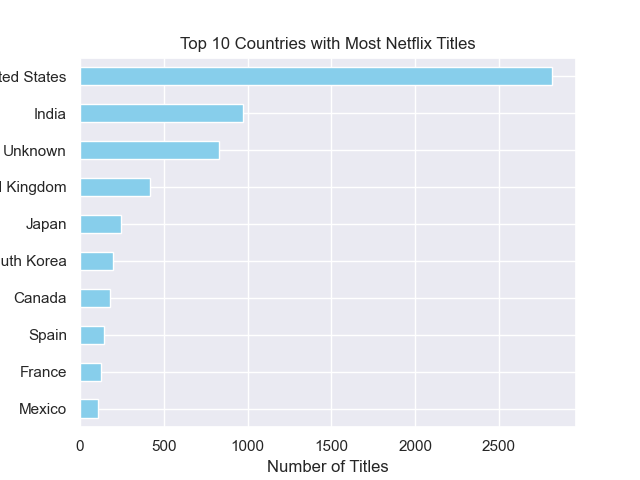
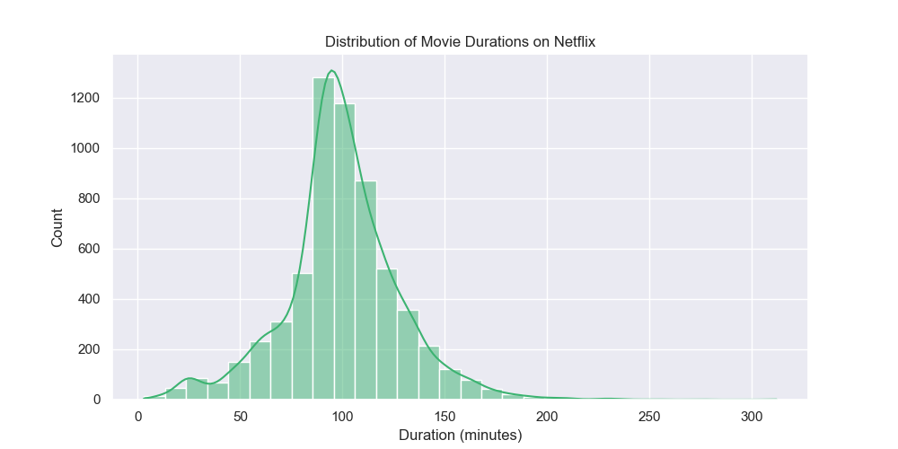
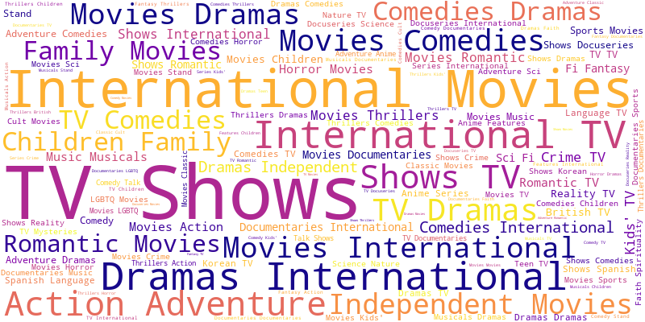

# 📺 Netflix Movies & Shows Analysis

This project explores Netflix’s movie and TV show dataset to uncover trends in content types, genres, countries of origin, ratings, and durations.

---

## 📁 Dataset

- Source: [Netflix Dataset on Kaggle](https://www.kaggle.com/shivamb/netflix-shows)  
- Contains details on movies and TV shows available on Netflix, including metadata like genres, countries, ratings, and durations.

---

## 🌍 Content Overview

- Movies vs TV Shows distribution  
- Content added over the years  
- Top countries producing Netflix content  
- Popular genres and rating breakdown  
- Movie duration analysis

---

## 📈 Visualizations

### 1. Content Type Distribution  

### 2. Content Added Over Time  

### 3. Top Countries Producing Content  

### 4. Genre Counts  

### 5. Rating Distribution  

### 6. Movie Duration Histogram  

### 7. Genre Word Cloud  

---

## 🛠️ Tools Used

- Python (Pandas, Matplotlib, Seaborn)  
- Jupyter Notebook  
- WordCloud

---

## 🚀 How to Run

1. Clone this repository  
2. Open the Jupyter Notebook  
3. Run the notebook cells sequentially  

---

## 📌 Author

Made with ❤️ by [Farah]
